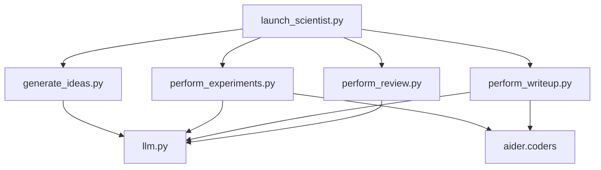

# AI Scientist Developer Documentation

## Code Architecture Deep Dive

This document provides detailed technical documentation for developers looking to understand, modify, or extend the AI Scientist codebase.

## Module Dependencies



## Core Classes and Functions

### 1. LLM Integration Layer (`ai_scientist/llm.py`)

#### Key Functions:

```python
def create_client(model: str) -> object:
    """
    Creates appropriate client based on model provider
    
    Supported providers:
    - OpenAI (gpt-4o, gpt-4o-mini)
    - Anthropic (claude-3-5-sonnet)
    - Google (gemini-1.5-pro)
    - OpenRouter (deepseek, llama)
    """

def get_response_from_llm(
    msg: str, 
    client: object, 
    model: str, 
    system_message: str = ""
) -> str:
    """
    Unified interface for getting responses from different LLM providers
    Handles provider-specific API calls and response parsing
    """

def extract_json_between_markers(llm_output: str) -> dict:
    """
    Extracts JSON content from LLM responses
    Handles various markdown code block formats
    """
```

### 2. Idea Generation (`ai_scientist/generate_ideas.py`)

#### Core Algorithm:

```python
def generate_ideas(
    base_dir: str,
    client: object, 
    model: str,
    max_num_generations: int,
    num_reflections: int
) -> List[Dict]:
    """
    Main idea generation pipeline:
    
    1. Load existing ideas to avoid duplication
    2. Generate new ideas using structured prompts
    3. Perform reflection and refinement
    4. Score ideas on interestingness, feasibility, novelty
    5. Return ranked list of ideas
    """
```

#### Prompt Engineering:

The system uses carefully crafted prompts with:
- **Task Description**: Research domain context
- **Code Context**: Available experimental framework
- **Previous Ideas**: To avoid duplication
- **Structured Output**: JSON format for parsing

#### Novelty Checking:

```python
def check_idea_novelty(
    ideas: List[Dict],
    base_dir: str,
    client: object,
    model: str
) -> List[Dict]:
    """
    Uses Semantic Scholar API to check novelty:
    
    1. Extract key terms from idea description
    2. Search academic papers via S2 API
    3. Compare idea against existing work
    4. Filter out ideas with high similarity
    """
```

### 3. Experiment Execution (`ai_scientist/perform_experiments.py`)

#### Experiment Runner:

```python
def perform_experiments(
    idea: Dict,
    folder_name: str, 
    coder: Coder,
    baseline_results: Dict
) -> str:
    """
    Implements the experiment execution loop:
    
    1. Plan experiments based on idea description
    2. Implement code changes using AI coder
    3. Run experiments (up to MAX_RUNS)
    4. Collect and analyze results
    5. Iterate based on outcomes
    """
```

#### Safety and Resource Management:

```python
def run_experiment(folder_name: str, run_num: int, timeout: int = 7200):
    """
    Executes single experiment with:
    - Subprocess isolation
    - Timeout protection (2 hours default)
    - Error capture and logging
    - Resource cleanup
    """
```

#### Key Constants:
- `MAX_ITERS = 4`: Maximum iteration cycles
- `MAX_RUNS = 5`: Maximum experiment runs
- `MAX_STDERR_OUTPUT = 1500`: Error output limit

### 4. Paper Writing (`ai_scientist/perform_writeup.py`)

#### Document Generation Pipeline:

```python
def perform_writeup(
    idea: Dict,
    folder_name: str,
    coder: Coder, 
    cite_client: object,
    cite_model: str,
    num_cite_rounds: int = 20,
    engine: str = "semanticscholar"
) -> None:
    """
    Multi-stage paper writing process:
    
    1. Generate paper sections sequentially
    2. Add citations using Semantic Scholar
    3. Refine each section iteratively  
    4. Compile final LaTeX document
    5. Generate PDF output
    """
```

#### Section-Specific Tips:

The system uses customized prompts for each paper section:

```python
per_section_tips = {
    "Abstract": "Concise, complete summary...",
    "Introduction": "Motivate the problem...", 
    "Related Work": "Comprehensive literature review...",
    "Method": "Clear technical description...",
    "Results": "Objective analysis...",
    "Conclusion": "Summarize contributions..."
}
```

#### Citation Integration:

```python
def get_citation_aider_prompt(
    cite_client: object,
    cite_model: str,
    draft: str,
    bibtex_entries: str,
    num_cite_rounds: int,
    engine: str = "semanticscholar"
) -> Tuple[str, bool]:
    """
    Intelligently adds citations:
    
    1. Analyze draft for citation needs
    2. Search relevant papers via API
    3. Generate appropriate BibTeX entries
    4. Insert \cite{} commands in text
    """
```

### 5. Review System (`ai_scientist/perform_review.py`)

#### Review Pipeline:

```python
def perform_review(
    paper_path: str,
    review_client: object,
    review_model: str,
    num_reflections: int = 5,
    num_fs_examples: int = 1
) -> Dict:
    """
    Automated peer review process:
    
    1. Load and parse paper PDF
    2. Generate detailed review using ICLR criteria
    3. Score paper on multiple dimensions
    4. Provide specific improvement suggestions
    5. Return structured review
    """
```

#### Review Criteria:

Based on ICLR review standards:
- Technical Quality
- Novelty/Originality  
- Significance
- Experimental Design
- Clarity
- Soundness

## Template System Architecture

### Template Structure:

Each template must implement:

```python
# experiment.py - Core experimental logic
def main():
    parser = argparse.ArgumentParser()
    parser.add_argument("--out_dir", type=str, required=True)
    # ... other template-specific arguments
    
    args = parser.parse_args()
    
    # Implement experiment logic
    # Save results to args.out_dir
    
# plot.py - Visualization 
def plot_results():
    # Generate figures for paper
    
# template.tex - LaTeX template
% Pre-configured academic paper template
% With proper citation style and formatting
```

### Template Requirements:

1. **Standardized Interface**: All experiments use `--out_dir=run_i` 
2. **Result Format**: JSON files with metrics
3. **Visualization**: Consistent plotting functions
4. **Documentation**: Clear setup instructions

## Error Handling and Debugging

### Common Error Patterns:

1. **API Failures**:
   ```python
   @backoff.on_exception(backoff.expo, Exception, max_tries=3)
   def api_call_with_retry():
       # Implement exponential backoff
   ```

2. **Code Execution Errors**:
   ```python
   try:
       result = subprocess.run(command, timeout=timeout, capture_output=True)
       if result.returncode != 0:
           # Handle execution failure
   except TimeoutExpired:
       # Handle timeout
   ```

3. **Parsing Errors**:
   ```python
   def safe_json_parse(text: str) -> Dict:
       try:
           return json.loads(text)
       except json.JSONDecodeError:
           # Attempt to extract JSON from text
   ```

### Debugging Tools:

1. **Verbose Logging**:
   ```python
   import logging
   logging.basicConfig(level=logging.DEBUG)
   ```

2. **Intermediate File Inspection**:
   - Check `run_i/` directories for experiment outputs
   - Review `.aider.chat.history.md` for code generation logs
   - Examine LaTeX compilation logs

3. **Manual Stepping**:
   ```bash
   # Run individual stages
   python launch_scientist.py --skip-experiments --skip-writeup
   python launch_scientist.py --skip-idea-generation --skip-writeup  
   python launch_scientist.py --skip-idea-generation --skip-experiments
   ```

## Performance Optimization

### Memory Management:

```python
# Clear GPU memory between experiments
if torch.cuda.is_available():
    torch.cuda.empty_cache()

# Limit model size for memory-constrained environments
model_config = {
    "max_memory": {0: "10GB", "cpu": "20GB"}
}
```

### Parallel Processing:

```python
# Parallel idea generation
from multiprocessing import Pool

def generate_idea_parallel(args):
    # Individual idea generation
    pass

with Pool(processes=num_cores) as pool:
    ideas = pool.map(generate_idea_parallel, idea_configs)
```

### API Rate Limiting:

```python
import time
from functools import wraps

def rate_limit(calls_per_minute=60):
    def decorator(func):
        @wraps(func)
        def wrapper(*args, **kwargs):
            time.sleep(60 / calls_per_minute)
            return func(*args, **kwargs)
        return wrapper
    return decorator
```

## Security Considerations

### Code Execution Safety:

1. **Sandboxing**: Use Docker containers
2. **Resource Limits**: Set memory/CPU limits
3. **Network Isolation**: Restrict internet access
4. **File System**: Use read-only mounts where possible

### API Security:

1. **Key Management**: Environment variables only
2. **Request Validation**: Sanitize inputs
3. **Rate Limiting**: Prevent API abuse
4. **Audit Logging**: Track all API calls

## Extension Guidelines

### Adding New LLM Providers:

1. Update `AVAILABLE_LLMS` dictionary
2. Implement provider-specific client creation
3. Add response parsing logic
4. Test with existing workflows

### Creating New Templates:

1. Follow template structure conventions
2. Implement standardized interfaces
3. Provide comprehensive documentation
4. Include example results

### Extending Review Criteria:

1. Add new scoring dimensions
2. Update prompt templates
3. Modify result aggregation
4. Validate against human reviews

## Testing Strategy

### Unit Tests:

```python
# Test LLM integration
def test_llm_response():
    mock_client = MockLLMClient()
    response = get_response_from_llm("test", mock_client, "gpt-4")
    assert response is not None

# Test idea generation
def test_idea_format():
    idea = generate_single_idea(test_prompt)
    assert all(key in idea for key in ["Name", "Title", "Experiment"])
```

### Integration Tests:

```python
# Test full pipeline on simple template
def test_end_to_end():
    result = run_full_pipeline("simple_template", max_ideas=1)
    assert result["status"] == "success"
    assert os.path.exists(result["paper_path"])
```

### Performance Tests:

```python
# Measure execution time
def test_performance():
    start_time = time.time()
    run_experiment_batch(test_ideas)
    execution_time = time.time() - start_time
    assert execution_time < MAX_ALLOWED_TIME
```

## Contributing Guidelines

### Code Style:

- Follow PEP 8 conventions
- Use type hints where appropriate
- Add docstrings for public functions
- Maintain consistent error handling

### Pull Request Process:

1. Fork repository
2. Create feature branch
3. Implement changes with tests
4. Update documentation
5. Submit PR with clear description

### Issue Reporting:

Include:
- Environment details
- Reproduction steps  
- Expected vs actual behavior
- Relevant log outputs

This developer documentation should help contributors understand the codebase structure and extend the system effectively.